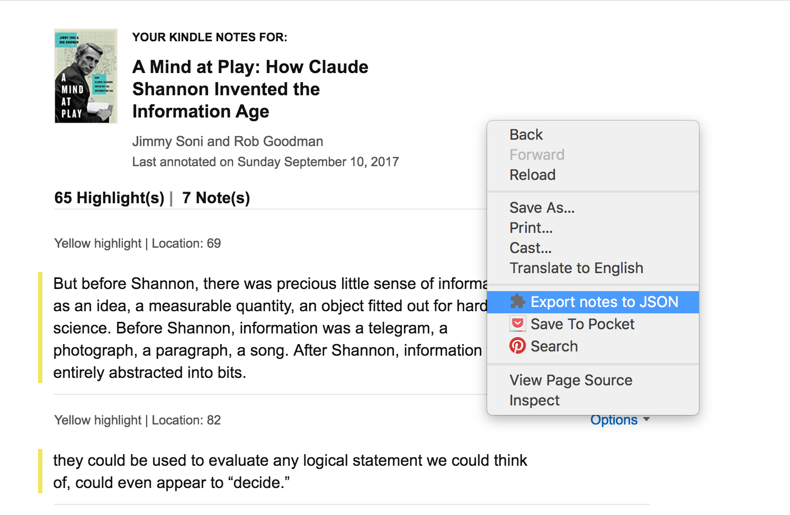

# amaJSON

## Synopsis

A Chrome extension for exporting Amazon Kindle highlights and notes on a book as JSON. Thus "Ama(zon) + JSON" = "amaJSON".

Also, _ama_ is second-person imparative for "Love!" in Latin. And we all love
JSON.

## Usage

### Select a Book from Your Library


_NOTE_: If you take a great number of notes or have a great number of highlights, Amazon may do a lazy-load. To be sure, scroll to the bottom of the book's page to make sure everything is loaded. Their default load has been sufficient for my uses though.

### Click for a Context Menu



### Alert for Confirmation


### Viol&agrave;

You now have a JSON representation of your book notes. I save mine to a file in
a git repository for review / search etc. Here's a sample of the output:

```json
  "title": "A Mind at Play: How Claude Shannon Invented the Information Age",
  "author": "Jimmy Soni and Rob Goodman",
  "highlightCount": "65",
  "noteCount": "7",
  "annotations": [
    {
      "highlight": "But before Shannon, there was precious little sense of
information as an idea, a measurable quantity, an object fitted out for hard
science. Before Shannon, information was a telegram, a photograph, a paragraph,
a song. After Shannon, information was entirely abstracted into bits.",
      "location": 69,
      "annotation": ""
    },
    {
      "highlight": "they could be used to evaluate any logical statement we
could think of, could even appear to “decide.”",
      "location": 82,
      "annotation": ""
    },
```

## Installation

Eventually this may reach the Chrome Extensions store. For the time being, take
the `src` directory and put it somewhere on your hard disk. You might want to
rename the directory to something like `amaJSON` or `kindle_exporter`.

1. Navigate to  `chrome://extensions`
1. Click the checkbox in the top right to enable "Developer Mode."
1. Click "Load unpacked extension..."
1. Provide the path to the `src` directory.
1. Reload your Kindle notes page. You should now be able to use the context menu.

## Bugs

File an Issue here if there is a bug
